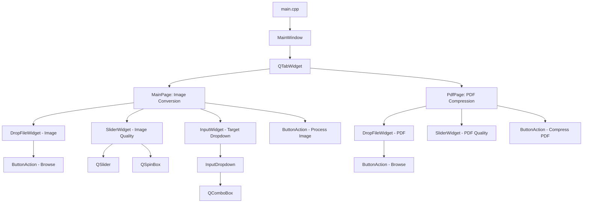

# Architecture & Codebase Design

## 1. Overview
The application follows a modular, widget-oriented Qt architecture. It separates the top-level presentation shell (`MainWindow`), the distinct feature pages (`MainPage`, `PdfPage`), atomic custom widgets (`DropFileWidget`, `SliderWidget`, etc.), and centralized styling tokens (`Colors`, `TextStyle`).

---

## 2. Component Hierarchy

---

## 3. Core Modules & Responsibilities

### [MainWindow](file:///d:/matkul/sem_6/AppProject/ImageConverter/mainwindow/mainwindow.h)
- **Role**: Window host and tab orchestrator.
- **Window Flags**: Fixed size dialog hint (`Qt::MSWindowsFixedSizeDialogHint | Qt::WindowMinimizeButtonHint | Qt::WindowCloseButtonHint`).
- **Tab Layout**: Uses custom CSS on `QTabWidget` (fixed width 352px, margins 32px) to provide clean active/hover tab pill buttons.

### [MainPage](file:///d:/matkul/sem_6/AppProject/ImageConverter/pages/main_page.h)
- **Role**: High-level controller for image conversion.
- **Components**:
  - `DropFileWidget` in image mode.
  - `SliderWidget` for compression quality (0–100).
  - `InputWidget` with `InputDropdown` containing `["jpg", "jpeg", "png", "webp", "tiff"]`.
  - `ButtonAction` triggering conversion.
- **Orchestration**:
  - Validates if input files exist.
  - For single file: calls `DropFileWidget::convertImage()`, prompting `QFileDialog::getSaveFileName()`.
  - For batch files: prompts `QFileDialog::getExistingDirectory()`, loops over files, creates `QImage`, and saves to the target folder with the chosen extension. Displays batch completion stats via `MessageBoxWidget`.

### [PdfPage](file:///d:/matkul/sem_6/AppProject/ImageConverter/pages/pdf_page.h)
- **Role**: Controller and processing engine for PDF compression.
- **Components**:
  - `DropFileWidget` in PDF mode.
  - `SliderWidget` for PDF quality (0–100).
  - `ButtonAction` triggering compression.
- **Processing Engine**:
  - Uses `QPdfDocument` to load source PDF.
  - Calculates DPI (72–200 DPI) and scaling factor (0.5–2.0).
  - Renders each page to `QImage`.
  - Applies color quantization (`Format_Indexed8` or `Format_RGB888`) and downsampling based on quality thresholds.
  - Writes pages into a new PDF using `QPdfWriter` and `QPainter`.

### [DropFileWidget](file:///d:/matkul/sem_6/AppProject/ImageConverter/widgets/drop_file_widget.h)
- **Role**: Universal drag-and-drop zone and file picker.
- **Interactivity**:
  - Listens to `dragEnterEvent` and `dropEvent`, validating file extensions (`png, jpg, jpeg, webp, tiff, pdf`).
  - Toggles visual state between empty upload placeholder (`m_emptyFieldWidget`) and selected file card (`m_chosenFileWidget`).
  - Contains core `saveImage` implementation interfacing with `QImage::save`.

### [SliderWidget](file:///d:/matkul/sem_6/AppProject/ImageConverter/widgets/slider_widget.h)
- **Role**: Coordinated slider + numeric spin box input widget.
- **Synchronization**:
  - Signals from `QSlider::valueChanged` update `QSpinBox` with `blockSignals(true)`.
  - Signals from `QSpinBox::valueChanged` update `QSlider` with `blockSignals(true)`.
  - Emits custom `valueChanged()` signal to parent widgets.

---

## 4. CMake Target Architecture
Defined in [CMakeLists.txt](file:///d:/matkul/sem_6/AppProject/ImageConverter/CMakeLists.txt):
- `PROJECT_WIDGETS`: All reusable UI components under `widgets/`.
- `PROJECT_STYLES`: Design tokens (`styles/colors.h`, `styles/text_style.h`) and resources (`resources/icons.qrc`).
- `PROJECT_PAGES`: Main application views under `pages/`.
- `PROJECT_SOURCES`: Entry point and main window.
- Links `Qt6::Core`, `Qt6::Widgets`, `Qt6::Pdf`.
