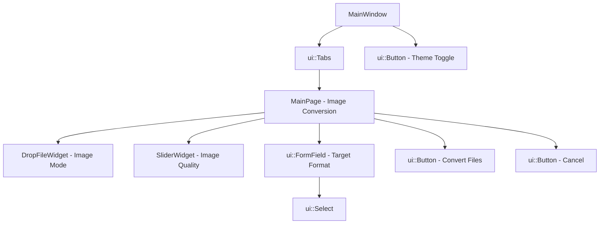

# System Architecture & Component Hierarchy

## 1. High-Level Architecture Overview
`ImageConverter` is organized into three distinct layers:
1. **Application Shell & Navigation** (`MainWindow`, `ui::Tabs`): Manages the window container, theme switching, and top-level page views.
2. **Feature View Controllers** (`MainPage`, `PdfPage`): Handle domain logic, batch orchestration, asynchronous threading (`QtConcurrent`), and error presentation.
3. **UI Kit & Widgets Layer** (`ui-kit/`, `widgets/`): Reusable Shadcn-styled components (`ui::Button`, `ui::Select`, `ui::FormField`, `ui::Input`, `DropFileWidget`, `SliderWidget`).

---

## 2. Component Hierarchy Diagram

---

## 3. Core Modules & Responsibilities

### [`MainWindow`](../../mainwindow/mainwindow.h)
- **Role**: Window host and tab orchestrator.
- **Header**: Includes title and `ui::Button` 3-way theme toggle (Light / Dark / System).
- **Tab Layout**: Uses `ui::Tabs` (Underline variant) hosting the active "Convert Image" (`MainPage`) view.

### [`MainPage`](../../pages/main_page.h)
- **Role**: High-level controller for image conversion.
- **Components**:
  - `DropFileWidget` in image mode.
  - `SliderWidget` for compression quality (0–100).
  - `ui::Select` containing `["JPG", "JPEG", "PNG", "WEBP", "TIFF", "BMP", "GIF", "PDF"]`.
  - `ui::Button` triggering conversion.
- **Orchestration**:
  - Validates if input files exist.
  - For single file: calls `DropFileWidget::convertImage()`, prompting `QFileDialog::getSaveFileName()`.
  - For batch files: prompts `QFileDialog::getExistingDirectory()`, loops over files, creates `QImage`, and saves to the target folder with the chosen extension. Displays batch completion stats via `MessageBoxWidget`.

### [`PdfPage`](../../pages/pdf_page.h)
- **Role**: Standalone controller and processing engine for PDF compression.
- **Components**:
  - `DropFileWidget` in PDF mode.
  - `SliderWidget` for PDF quality (0–100).
  - `ButtonAction` triggering compression.
- **Processing Engine**:
  - Uses `QPdfDocument` to load source PDF.
  - Calculates DPI (72–200 DPI) and scaling factor (0.5–2.0).
  - Renders each page to `QImage`.
  - Applies color quantization (`Format_Indexed8` or `Format_RGB888`) and downsampling based on quality thresholds.
  - Writes pages into a new PDF using `QPdfWriter` and `QPainter`.

### [`DropFileWidget`](../../widgets/drop_file_widget.h)
- **Role**: Universal drag-and-drop zone and file picker.
- **Interactivity**:
  - Listens to `dragEnterEvent` and `dropEvent`, validating file extensions (`png, jpg, jpeg, webp, tiff, bmp, gif, pdf`).
  - Toggles visual state between empty upload placeholder (`m_emptyFieldWidget`) and selected file card (`m_chosenFileWidget`).
  - Contains core `saveImage` and `convertImage` implementation interfacing with `QImage::save`.

### [`SliderWidget`](../../widgets/slider_widget.h)
- **Role**: Coordinated slider + numeric spin box input widget.
- **Synchronization**:
  - Signals from `QSlider::valueChanged` update `QSpinBox` with `blockSignals(true)`.
  - Signals from `QSpinBox::valueChanged` update `QSlider` with `blockSignals(true)`.
- **Layout**: Stack layout: `[Label] -> [SpinBox] -> [Slider]` with Lucide stepper arrows.
