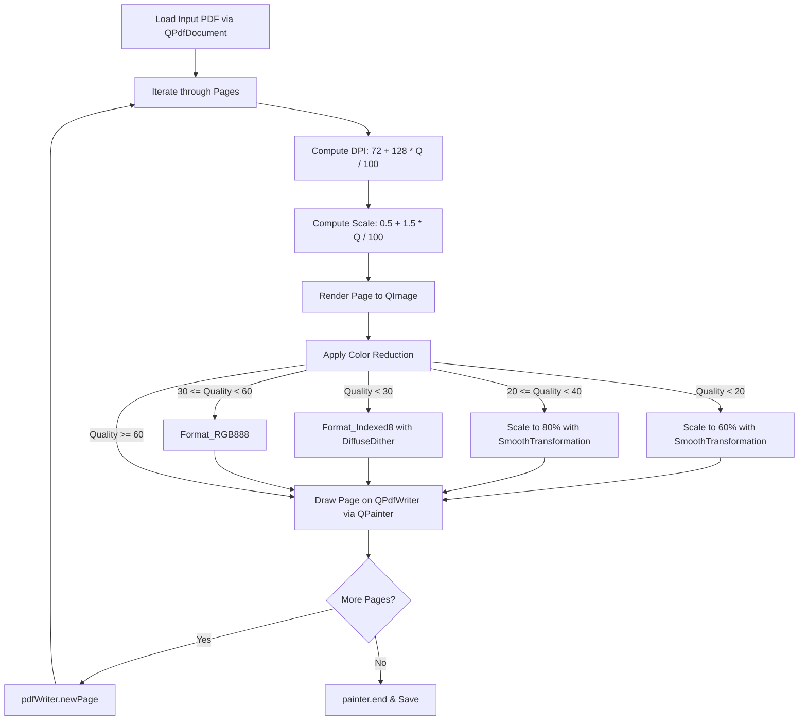

# Conversion & Compression Pipeline Specifications

## 1. Image Conversion Engine

### 1.1 Supported Formats
The core image conversion logic is implemented in `DropFileWidget::saveImage()` and `MainPage::onProcessButtonClicked()`:

| Format Token | File Suffix | Quality Support (0-100)    | Implementation Detail                          |
| :----------- | :---------- | :------------------------- | :--------------------------------------------- |
| `JPG`        | `.jpg`      | Yes (0–100)                | `image->save(path + ".jpg", "JPG", quality)`   |
| `JPEG`       | `.jpeg`     | Yes (0–100)                | `image->save(path + ".jpeg", "JPEG", quality)` |
| `PNG`        | `.png`      | No (-1 = lossless default) | `image->save(path + ".png", "PNG", -1)`        |
| `WEBP`       | `.webp`     | Yes (0–100)                | `image->save(path + ".webp", "WEBP", quality)` |
| `TIFF`       | `.tiff`     | Yes (0–100)                | `image->save(path + ".tiff", "TIFF", quality)` |

### 1.2 Execution Lifecycle (Image)
1. **Input Validation**:
   - Checks `sourcePaths.isEmpty()`. Displays `MessageBoxWidget::Critical` if no file selected.
2. **Single File Flow**:
   - Prompts `QFileDialog::getSaveFileName()` with default path `<original>_converted.<ext>`.
   - Reads image into `QImage(sourcePath)`. If null, shows critical error dialog.
   - Saves file using `saveImage()`. Displays success or failure message box.
3. **Batch File Flow**:
   - Prompts `QFileDialog::getExistingDirectory()` to choose destination folder.
   - Iterates through all selected paths.
   - Strips base name and writes each converted image to `targetDir/<baseName>.<ext>`.
   - Tracks `successCount` and `failureCount`, presenting summary dialog upon completion.

---

## 2. PDF Compression Engine

### 2.1 Technical Strategy
PDF files in Qt do not have a direct native lossless vector compression API. `PdfPage` performs page rasterization, color reduction, downsampling, and document reconstruction using `QPdfDocument` and `QPdfWriter`.

### 2.2 Mathematical Formulas & Thresholds

1. **Resolution (DPI)**:
   $$\text{DPI} = 72 + \left\lfloor \frac{(200 - 72) \times \text{Quality}}{100} \right\rfloor$$
   - Minimum DPI: 72 (standard screen resolution)
   - Maximum DPI: 200 (print/high fidelity)

2. **Render Scaling Factor**:
   $$\text{Scale} = 0.5 + \left( \frac{1.5 \times \text{Quality}}{100} \right)$$
   - Minimum scale: 0.5x
   - Maximum scale: 2.0x

3. **Color Quantization**:
   - `Quality < 30`: `QImage::Format_Indexed8` with `Qt::DiffuseDither` (drastically lowers memory and file footprint).
   - `30 <= Quality < 60`: `QImage::Format_RGB888` (drops alpha channel / 32-bit overhead).
   - `Quality >= 60`: Preserves full image format.

4. **Dimension Rescaling**:
   - `Quality < 20`: Dimensions scaled down to 60% (`Qt::SmoothTransformation`).
   - `20 <= Quality < 40`: Dimensions scaled down to 80% (`Qt::SmoothTransformation`).
